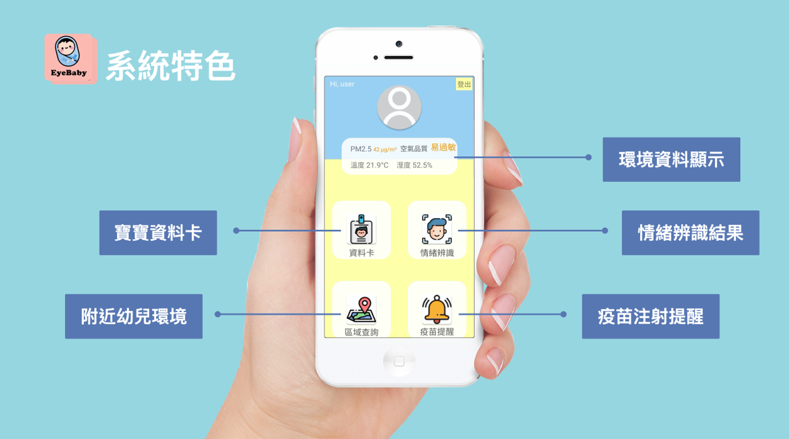
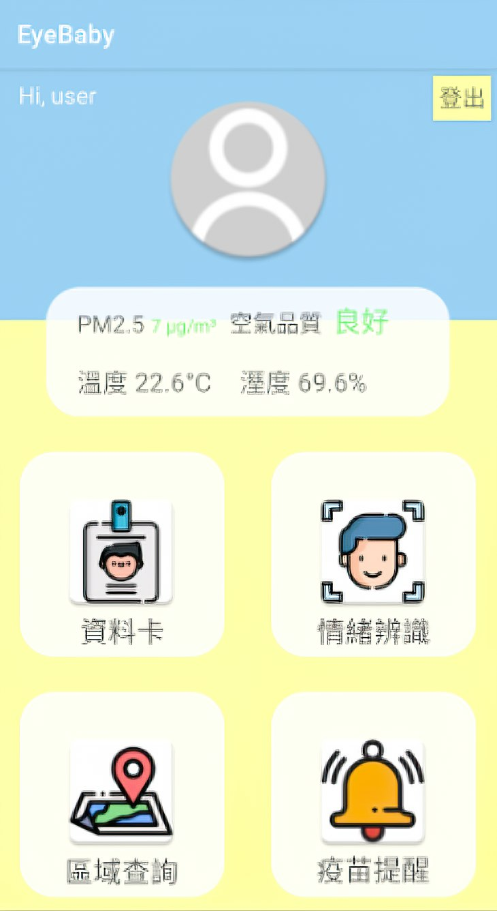
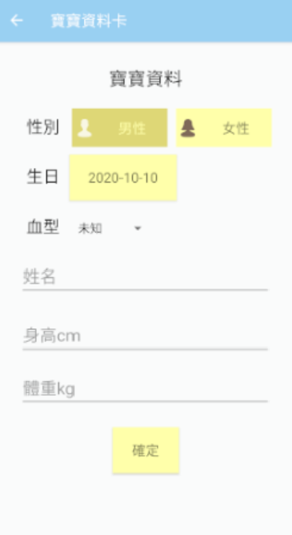
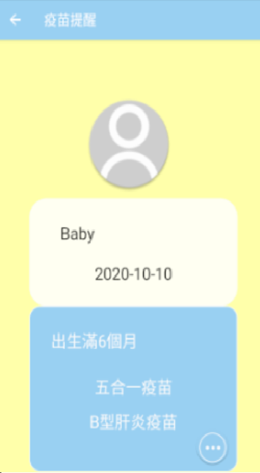
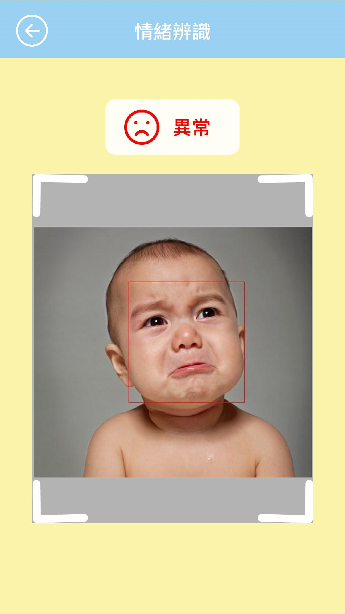
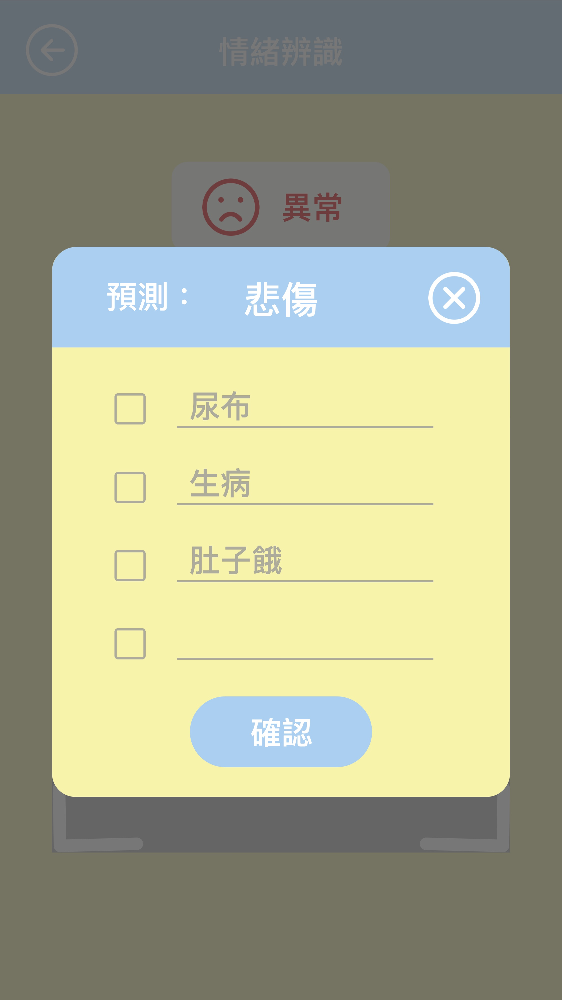
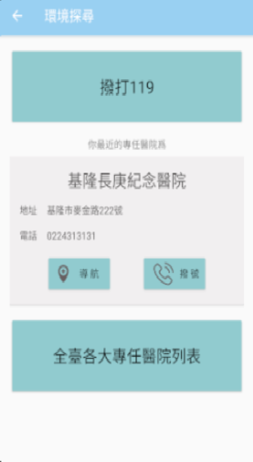

# EyeBaby

根據衛福部統計，近年嬰兒死亡率逐年下降，但嬰兒死亡原因之一嬰兒猝死率排名卻往上提升，而1歲以下最常見的猝死原因，如趴睡、溢奶、被棉被悶住、吸入異物等，若照顧者能在寶寶的掙扎期快速發現，或許就能避免憾事發生。

為了解決此問題，本團隊應用手機app隨時偵測寶寶當下情況且附加情境提醒，判斷寶寶的情緒狀態以警示照顧者，讓照顧者只需要有智慧型手機，無需負擔而外成本即可陪伴寶寶健康長大。

## Introduction
EyeBaby使用Android Studio開發，並且利用Windows Azure情緒辨識技術結合資料庫進行嬰兒情緒分析，並且當嬰兒情緒異常時發出聲響，通知使用者查看嬰兒的狀況，為了讓照顧者能夠更適當的照顧幼兒，會記錄幼兒的哭聲以及讓父母選擇可能的原因，並且在往後情緒異常時能依據哭聲和以往的發生原因結合神經網路預測出可能的結果，提供照顧者在照顧幼兒時不會因幼兒的哭聲而慌張而是能依據狀況迅速地做出適當的處理，並且給予室內溫度跟濕度的測量使得照顧者能更適當的取得當前環境狀態。

EyeBaby提供幼兒打疫苗的提醒，以及結合政府Open Data資料及民間資料對附近區域搜尋出適當的公園、親子餐廳、幼兒園、藥局及診所等讓父母對幼兒的娛樂以及教育甚至是醫療提供一些貼心地功能整合，並且EyeBaby也會顯示當地空氣污染指數讓照顧者判斷是否適合外出。

## Getting Started
EyeBaby 有五大功能:

1. 提供填寫寶寶資料卡 
2. 附近環境探索
3. 環境資料顯示
4. 寶寶及時情緒辨識
5. 疫苗施打提醒

### 寶寶資料卡
此功能的目的在於讓使用者填寫嬰兒資訊，紀錄寶寶成長歷程。此外，當嬰兒到達該施打某種疫苗時，系統會發送推播提醒。

### 附近環境探索
為了讓照顧者能夠掌握附近各項資源，因此EyeBaby結合政府開放資料搜尋出附近幼兒園、公園、親子餐廳等各項教育與娛樂的地點，讓照顧者能充分利用各項教育、休閒資源，使幼兒有更好的生活品質。

### 環境資料顯示
為保護幼兒避免長期暴露在PM2.5環境下，EyeBaby利用手機定位系統判斷當地空氣污染指數，讓照顧者能夠在快速地了解當地空氣品質，減少在環境情況差的情況外出，降低幼兒過敏風險。

### 情緒辨識
本專案最主要的功能，攝影機偵測幼兒情緒，推斷幼兒是否遭遇危險，當幼兒情緒異常，會發出警訊以及可能原因通知照顧者，並且會記錄哭聲讓照顧者選擇情緒異常原因，當往日後幼兒情緒異常時能夠結合以往資訊，給照顧者提供一些可能建議。

### 疫苗施打提醒
提醒父母幼兒定期施打疫苗的時間，以免父母忘記讓幼兒施打疫苗，使得幼兒暴露在危險之中，並且提供寶寶應施打疫苗總時間表。

## Usage
下載APK檔後，到手機安裝此程式。

- 打開程式後會顯示登入畫面，輸入帳密完成後就會到主畫面，此時就能開始使用各種功能。

- 點擊資料卡填寫嬰兒資料卡以供後續情緒辨識紀錄及施打疫苗提醒。

- 當進行情緒時，若情緒異常將會讓使用者選擇可能產生的原因，以供後續的紀錄。

- 最後點擊區域查詢時，將可以顯示出離當前位置最近的幾個醫院位置。

